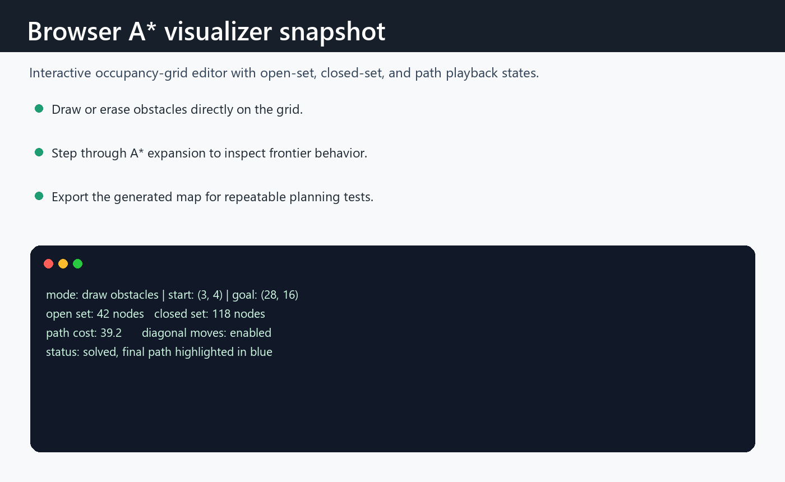

# 2D Occupancy Grid + A* Planner Visualization

Interactive browser project for drawing a 2D occupancy grid, running A* search, and watching the open set, closed set, current node, and final path evolve over time.

The repository also includes an optional ROS 2/Gazebo demo that mirrors the same robotics idea: Gazebo shows a small obstacle world while a ROS 2 node publishes a matching `nav_msgs/OccupancyGrid` and `nav_msgs/Path`.

## Features

- Draw walls, erase cells, and move start/goal markers directly on the grid.
- Run, pause, step, reset, or instantly solve the A* planner.
- Compare grid, Euclidean, and Chebyshev heuristics.
- Toggle diagonal moves with corner-cutting prevention.
- Generate sample, random, and maze-like maps.
- Export and import map JSON.
- Run planner tests with Node.js and no third-party packages.
- Launch an optional ROS 2/Gazebo simulation package from `sim/ros2_astar_gazebo`.

## Quick Start

Open [index.html](index.html) directly in a browser, or run the small local server:

```bash
npm start
```

Then visit:

```text
http://localhost:5173
```

Run the planner tests:

```bash
npm test
```

## Project Layout

```text
.
├── index.html
├── package.json
├── scripts/
│   └── dev-server.js
├── src/
│   ├── app.js
│   ├── planner.js
│   └── styles.css
├── tests/
│   └── planner.test.js
└── sim/
    └── ros2_astar_gazebo/
```

## Gazebo / ROS 2 Demo

The simulation package is optional and is intended for a Linux ROS 2 environment with Gazebo installed. On Windows, the usual route is Ubuntu or WSL with GUI support.

From the repository root:

```bash
colcon build --base-paths sim/ros2_astar_gazebo
source install/setup.bash
ros2 launch ros2_astar_gazebo demo.launch.py
```

The launch file starts:

- Gazebo with `worlds/occupancy_grid_demo.sdf`
- `grid_planner_node`, which publishes:
  - `/demo/occupancy_grid`
  - `/demo/astar_path`

If Gazebo is not installed, you can still run only the ROS 2 publisher:

```bash
ros2 launch ros2_astar_gazebo demo.launch.py use_gazebo:=false
```

Use RViz with the fixed frame set to `map` to view the occupancy grid and path.

## Notes

The browser app is dependency-free by design. The planner core lives in [src/planner.js](src/planner.js), so it can be tested from Node.js and used by the visualization without duplicating A* logic.

## Result screenshots



Browser visualizer state showing grid editing, frontier expansion, and solved path feedback.


## What this demonstrates

- Interactive A* exploration in a browser with no backend dependency.
- Planner state visualization for open set, closed set, current node, and final path.
- A small testable JavaScript codebase with optional ROS 2/Gazebo simulation notes.


## Limitations and next steps

- The browser visualizer is educational and not a production navigation stack.
- The optional Gazebo integration depends on a local ROS 2 simulation environment.
- Next steps: add import/export presets and recorded demo clips.

